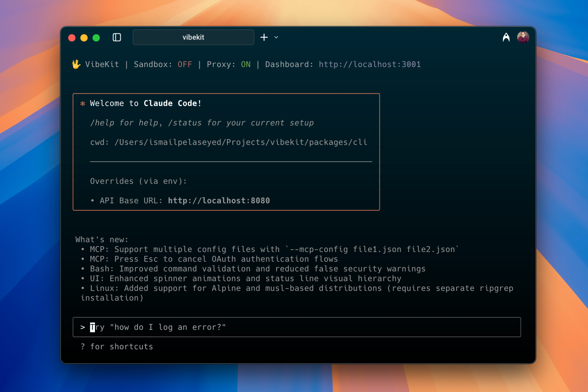

<div align="right">
  <details>
    <summary >🌐 Language</summary>
    <div>
      <div align="center">
        <a href="https://openaitx.github.io/view.html?user=superagent-ai&project=vibekit&lang=en">English</a>
        | <a href="https://openaitx.github.io/view.html?user=superagent-ai&project=vibekit&lang=zh-CN">简体中文</a>
        | <a href="https://openaitx.github.io/view.html?user=superagent-ai&project=vibekit&lang=zh-TW">繁體中文</a>
        | <a href="https://openaitx.github.io/view.html?user=superagent-ai&project=vibekit&lang=ja">日本語</a>
        | <a href="https://openaitx.github.io/view.html?user=superagent-ai&project=vibekit&lang=ko">한국어</a>
        | <a href="https://openaitx.github.io/view.html?user=superagent-ai&project=vibekit&lang=hi">हिन्दी</a>
        | <a href="https://openaitx.github.io/view.html?user=superagent-ai&project=vibekit&lang=th">ไทย</a>
        | <a href="https://openaitx.github.io/view.html?user=superagent-ai&project=vibekit&lang=fr">Français</a>
        | <a href="https://openaitx.github.io/view.html?user=superagent-ai&project=vibekit&lang=de">Deutsch</a>
        | <a href="https://openaitx.github.io/view.html?user=superagent-ai&project=vibekit&lang=es">Español</a>
        | <a href="https://openaitx.github.io/view.html?user=superagent-ai&project=vibekit&lang=it">Italiano</a>
        | <a href="https://openaitx.github.io/view.html?user=superagent-ai&project=vibekit&lang=ru">Русский</a>
        | <a href="https://openaitx.github.io/view.html?user=superagent-ai&project=vibekit&lang=pt">Português</a>
        | <a href="https://openaitx.github.io/view.html?user=superagent-ai&project=vibekit&lang=nl">Nederlands</a>
        | <a href="https://openaitx.github.io/view.html?user=superagent-ai&project=vibekit&lang=pl">Polski</a>
        | <a href="https://openaitx.github.io/view.html?user=superagent-ai&project=vibekit&lang=ar">العربية</a>
        | <a href="https://openaitx.github.io/view.html?user=superagent-ai&project=vibekit&lang=fa">فارسی</a>
        | <a href="https://openaitx.github.io/view.html?user=superagent-ai&project=vibekit&lang=tr">Türkçe</a>
        | <a href="https://openaitx.github.io/view.html?user=superagent-ai&project=vibekit&lang=vi">Tiếng Việt</a>
        | <a href="https://openaitx.github.io/view.html?user=superagent-ai&project=vibekit&lang=id">Bahasa Indonesia</a>
      </div>
    </div>
  </details>
</div>

<div align="center">



# VibeKit is the safety layer for your coding agent 🖖

Run Claude Code, Gemini, Codex — or any coding agent — in a clean, isolated sandbox with sensitive data redaction and observability baked in.

---

[Website](https://vibekit.sh) • [Docs](https://docs.vibekit.sh) • [Discord](https://discord.com/invite/mhmJUTjW4b)

---
</div>

## 🚀 Quick Start

Install the VibeKit CLI globally:

```bash
npm install -g vibekit
```

Run claude code with enhanced security and tracking

```bash
vibekit claude
```

## ⚡️ Key Features

🐳 **Local sandbox** - Runs agent output in isolated Docker containers — zero risk to your local setup

🔒 **Built-in redaction** - Auto-removes secrets, api keys, and other sensitive data completions

📊 **Observability** - Complete visibility into agent operations with real-time logs, traces, and metrics

🌐 **Universal agent support** - Works with Claude Code, Gemini CLI, Grok CLI, Codex CLI, OpenCode, and more

💻 **Works offline & locally** - No cloud dependencies or internet required — works entirely on your machine

## 📦 Related Packages

Looking to integrate VibeKit into your application? Check out these packages:


### [📚 VibeKit SDK](https://github.com/superagent-ai/vibekit/tree/main/packages/sdk)
Run coding agents in secure sandboxes with full control and monitoring.

```bash
npm install @vibe-kit/sdk
```

Perfect for building applications that need to execute AI-generated code safely.

### [🔐 VibeKit Auth](https://github.com/superagent-ai/vibekit/tree/main/packages/auth) 
Use your MAX subscriptions in AI Apps.

```bash
npm install @vibe-kit/auth
```

Handle authentication flows for your VibeKit-powered applications.


## 🤝 Contributing

Contributions welcome! Open an issue, start a discussion, or submit a pull request.

## 📄 License

MIT — see [LICENSE](./LICENSE) for details.

© 2025 Superagent Technologies Inc.
