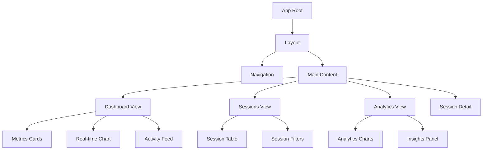
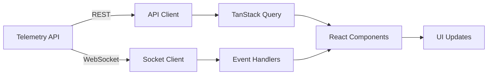

# @vibe-kit/dashboard

Real-time telemetry dashboard for VibeKit applications with advanced analytics, session tracking, and performance monitoring.

## Table of Contents

- [Overview](#overview)
- [Features](#features)
- [Installation](#installation)
- [Quick Start](#quick-start)
- [Architecture](#architecture)
- [Configuration](#configuration)
- [Components](#components)
- [API Integration](#api-integration)
- [Real-time Updates](#real-time-updates)
- [Development](#development)
- [Deployment](#deployment)
- [Customization](#customization)
- [Troubleshooting](#troubleshooting)
- [Best Practices](#best-practices)

## Overview

The `@vibe-kit/dashboard` package provides a modern, real-time web dashboard for monitoring and analyzing telemetry data from VibeKit applications. Built with React, Vite, TypeScript, and Tailwind CSS, it offers a responsive interface with live updates, interactive charts, and comprehensive analytics.

### Key Technologies

- **Frontend**: React 18 with TypeScript
- **Build Tool**: Vite for fast development and optimized builds
- **Styling**: Tailwind CSS with ShadCN UI components
- **Charts**: Recharts for data visualization
- **Real-time**: Socket.io for WebSocket connections
- **State Management**: TanStack Query for server state
- **Routing**: React Router for navigation

## Features

### Core Features
- **📊 Real-time Monitoring**: Live updates via WebSocket
- **📈 Interactive Analytics**: Visual charts and metrics
- **🔍 Session Tracking**: Detailed session analysis
- **⚡ Performance Metrics**: Response times, throughput, errors
- **🎨 Modern UI**: Clean, responsive design with dark mode
- **🔄 Auto-refresh**: Configurable polling intervals
- **📱 Mobile Friendly**: Responsive layout for all devices
- **🎯 Filtering**: Advanced data filtering and search

### Advanced Features
- **🧠 AI Insights**: Anomaly detection and predictions
- **📊 Custom Dashboards**: Configurable widget layouts
- **📤 Export Options**: Download data in multiple formats
- **🔔 Alerts**: Real-time notifications for anomalies
- **📝 Audit Trail**: Track all dashboard actions
- **🌐 Multi-tenant**: Support for multiple environments

## Installation

### Standalone Installation

```bash
npm install @vibe-kit/dashboard

# Required peer dependencies
npm install react react-dom
```

### Development Installation

```bash
# Clone the repository
git clone https://github.com/vibekit/vibekit.git
cd vibekit/packages/dashboard

# Install dependencies
npm install

# Start development server
npm run dev
```

## Quick Start

### Using with VibeKit CLI

The easiest way to start the dashboard is using the VibeKit CLI:

```bash
# Start telemetry server with dashboard
vibekit dashboard --port 3000 --dashboard-port 3001

# Or use the telemetry CLI
telemetry api --port 3000 --dashboard
```

### Manual Setup

1. **Start the Telemetry API Server**:
```bash
# From @vibe-kit/telemetry
telemetry api --port 3000 --cors
```

2. **Configure and Start Dashboard**:
```bash
# Set API URL (optional, defaults to http://localhost:3000)
export VITE_TELEMETRY_API_URL=http://localhost:3000

# Start dashboard
npm run dev
```

3. **Open in Browser**:
Navigate to `http://localhost:5173`

### Docker Setup

```dockerfile
# Dockerfile
FROM node:18-alpine AS builder
WORKDIR /app
COPY package*.json ./
RUN npm ci
COPY . .
RUN npm run build

FROM nginx:alpine
COPY --from=builder /app/dist /usr/share/nginx/html
COPY nginx.conf /etc/nginx/conf.d/default.conf
EXPOSE 80
```

## Architecture

### Component Structure



### Data Flow



## Configuration

### Environment Variables

Create a `.env.local` file in the dashboard directory:

```bash
# API Configuration
VITE_TELEMETRY_API_URL=http://localhost:3000
VITE_WS_URL=ws://localhost:3000

# Feature Flags
VITE_ENABLE_ANALYTICS=true
VITE_ENABLE_EXPORT=true
VITE_ENABLE_DARK_MODE=true

# Performance
VITE_POLLING_INTERVAL=5000
VITE_CHART_ANIMATION=true
VITE_MAX_EVENTS_DISPLAY=1000

# Authentication (if enabled)
VITE_AUTH_ENABLED=false
VITE_AUTH_PROVIDER=none
```

### Runtime Configuration

```typescript
// src/config.ts
export const config = {
  api: {
    baseUrl: import.meta.env.VITE_TELEMETRY_API_URL || 'http://localhost:3000',
    timeout: 30000,
    retries: 3
  },
  
  websocket: {
    url: import.meta.env.VITE_WS_URL || 'ws://localhost:3000',
    reconnection: true,
    reconnectionAttempts: 5,
    reconnectionDelay: 1000
  },
  
  ui: {
    theme: 'system', // 'light' | 'dark' | 'system'
    density: 'comfortable', // 'compact' | 'comfortable' | 'spacious'
    animations: true
  },
  
  features: {
    analytics: true,
    export: true,
    realtime: true,
    sessionDetail: true
  }
};
```

## Components

### Core Components

#### Dashboard Overview
```typescript
// Main dashboard with key metrics
<Dashboard>
  <MetricsGrid />
  <RealtimeChart />
  <SessionsTable />
  <ActivityFeed />
</Dashboard>
```

#### Session Management
```typescript
// Session list with filtering
<Sessions>
  <SessionFilters />
  <SessionTable />
  <Pagination />
</Sessions>

// Detailed session view
<SessionDetail sessionId={id}>
  <SessionInfo />
  <EventTimeline />
  <SessionMetrics />
</SessionDetail>
```

#### Analytics
```typescript
// Analytics dashboard
<Analytics>
  <DateRangePicker />
  <AnalyticsCharts />
  <InsightsPanel />
  <AnomalyDetection />
</Analytics>
```

### UI Components

The dashboard uses ShadCN UI components with Tailwind CSS:

```typescript
// Example: Metrics Card
import { Card, CardContent, CardHeader, CardTitle } from '@/components/ui/card';

function MetricCard({ title, value, change, icon }) {
  return (
    <Card>
      <CardHeader className="flex flex-row items-center justify-between space-y-0 pb-2">
        <CardTitle className="text-sm font-medium">{title}</CardTitle>
        {icon}
      </CardHeader>
      <CardContent>
        <div className="text-2xl font-bold">{value}</div>
        <p className="text-xs text-muted-foreground">
          {change > 0 ? '+' : ''}{change}% from last hour
        </p>
      </CardContent>
    </Card>
  );
}
```

## API Integration

### API Client

```typescript
// src/lib/telemetry-api.ts
class TelemetryAPI {
  constructor(private baseUrl: string) {}
  
  // Metrics
  async getMetrics(timeRange?: TimeRange): Promise<Metrics> {
    return this.fetch('/api/metrics', { params: timeRange });
  }
  
  // Sessions
  async getSessions(filter?: SessionFilter): Promise<Session[]> {
    return this.fetch('/api/sessions', { params: filter });
  }
  
  // Events
  async getEvents(filter?: EventFilter): Promise<Event[]> {
    return this.fetch('/api/events', { params: filter });
  }
  
  // Analytics
  async getAnalytics(options?: AnalyticsOptions): Promise<Analytics> {
    return this.fetch('/api/analytics', { params: options });
  }
  
  // Export
  async exportData(format: string, filter?: any): Promise<Blob> {
    return this.fetch('/api/export', {
      method: 'POST',
      body: { format, filter },
      responseType: 'blob'
    });
  }
}
```

### React Hooks

```typescript
// src/hooks/use-telemetry-api.ts
import { useQuery, useMutation } from '@tanstack/react-query';

// Fetch metrics with auto-refresh
export function useMetrics(timeRange?: TimeRange) {
  return useQuery({
    queryKey: ['metrics', timeRange],
    queryFn: () => api.getMetrics(timeRange),
    refetchInterval: 5000, // Refresh every 5 seconds
    staleTime: 4000
  });
}

// Fetch sessions with filtering
export function useSessions(filter?: SessionFilter) {
  return useQuery({
    queryKey: ['sessions', filter],
    queryFn: () => api.getSessions(filter),
    refetchInterval: 10000
  });
}

// Export data
export function useExport() {
  return useMutation({
    mutationFn: ({ format, filter }) => api.exportData(format, filter),
    onSuccess: (blob, { format }) => {
      // Download the file
      const url = URL.createObjectURL(blob);
      const a = document.createElement('a');
      a.href = url;
      a.download = `telemetry-export.${format}`;
      a.click();
    }
  });
}
```

## Real-time Updates

### WebSocket Connection

```typescript
// src/lib/websocket.ts
import { io, Socket } from 'socket.io-client';

class WebSocketClient {
  private socket: Socket;
  
  constructor(url: string) {
    this.socket = io(url, {
      transports: ['websocket'],
      reconnection: true
    });
    
    this.setupEventHandlers();
  }
  
  private setupEventHandlers() {
    // Connection events
    this.socket.on('connect', () => {
      console.log('WebSocket connected');
    });
    
    // Telemetry events
    this.socket.on('event', (event: TelemetryEvent) => {
      // Update local state or trigger refetch
      queryClient.invalidateQueries(['events']);
    });
    
    // Metrics updates
    this.socket.on('metrics:update', (metrics: Metrics) => {
      queryClient.setQueryData(['metrics'], metrics);
    });
    
    // Session updates
    this.socket.on('session:update', (session: Session) => {
      queryClient.setQueryData(
        ['sessions'],
        (old: Session[]) => {
          const index = old.findIndex(s => s.id === session.id);
          if (index >= 0) {
            old[index] = session;
          } else {
            old.push(session);
          }
          return [...old];
        }
      );
    });
  }
  
  // Subscribe to specific sessions
  subscribeToSession(sessionId: string) {
    this.socket.emit('subscribe:session', sessionId);
  }
  
  // Subscribe to metrics updates
  subscribeToMetrics() {
    this.socket.emit('subscribe:metrics');
  }
}
```

### React Integration

```typescript
// src/contexts/websocket-context.tsx
import { createContext, useContext, useEffect } from 'react';

const WebSocketContext = createContext<WebSocketClient | null>(null);

export function WebSocketProvider({ children, url }) {
  const [client] = useState(() => new WebSocketClient(url));
  
  useEffect(() => {
    return () => {
      client.disconnect();
    };
  }, [client]);
  
  return (
    <WebSocketContext.Provider value={client}>
      {children}
    </WebSocketContext.Provider>
  );
}

export function useWebSocket() {
  const client = useContext(WebSocketContext);
  if (!client) {
    throw new Error('useWebSocket must be used within WebSocketProvider');
  }
  return client;
}
```

## Development

### Project Structure

```
packages/dashboard/
├── src/
│   ├── components/       # React components
│   │   ├── ui/          # Base UI components
│   │   ├── charts/      # Chart components
│   │   ├── dashboard/   # Dashboard views
│   │   └── layout/      # Layout components
│   ├── hooks/           # Custom React hooks
│   ├── lib/             # Utilities and API
│   │   ├── api.ts       # API client
│   │   ├── websocket.ts # WebSocket client
│   │   └── utils.ts     # Helper functions
│   ├── contexts/        # React contexts
│   ├── types/           # TypeScript types
│   ├── App.tsx          # Main app component
│   └── main.tsx         # Entry point
├── public/              # Static assets
├── index.html           # HTML template
├── vite.config.ts       # Vite configuration
├── tailwind.config.ts   # Tailwind configuration
└── package.json         # Dependencies
```

### Development Workflow

1. **Start Development Server**:
```bash
npm run dev
# Dashboard available at http://localhost:5173
```

2. **Run Type Checking**:
```bash
npm run type-check
```

3. **Run Linting**:
```bash
npm run lint
```

4. **Build for Production**:
```bash
npm run build
npm run preview # Preview production build
```

### Adding New Features

#### 1. Create New Component
```typescript
// src/components/features/MyFeature.tsx
import { Card } from '@/components/ui/card';

export function MyFeature() {
  const { data, isLoading } = useMyFeatureData();
  
  if (isLoading) return <LoadingSpinner />;
  
  return (
    <Card>
      {/* Feature content */}
    </Card>
  );
}
```

#### 2. Add API Hook
```typescript
// src/hooks/use-my-feature.ts
export function useMyFeatureData() {
  return useQuery({
    queryKey: ['my-feature'],
    queryFn: () => api.getMyFeatureData()
  });
}
```

#### 3. Add Route
```typescript
// src/App.tsx
<Route path="/my-feature" element={<MyFeature />} />
```

## Deployment

### Production Build

```bash
# Build the dashboard
npm run build

# Output is in dist/ directory
# Can be served by any static file server
```

### Nginx Configuration

```nginx
server {
    listen 80;
    server_name dashboard.example.com;
    root /usr/share/nginx/html;
    
    # Enable gzip
    gzip on;
    gzip_types text/css application/javascript application/json;
    
    # Cache static assets
    location /assets {
        expires 1y;
        add_header Cache-Control "public, immutable";
    }
    
    # API proxy (if needed)
    location /api {
        proxy_pass http://telemetry-api:3000;
        proxy_set_header Host $host;
        proxy_set_header X-Real-IP $remote_addr;
    }
    
    # WebSocket proxy
    location /socket.io {
        proxy_pass http://telemetry-api:3000;
        proxy_http_version 1.1;
        proxy_set_header Upgrade $http_upgrade;
        proxy_set_header Connection "upgrade";
    }
    
    # SPA fallback
    location / {
        try_files $uri $uri/ /index.html;
    }
}
```

### Docker Compose

```yaml
version: '3.8'

services:
  telemetry-api:
    image: vibekit/telemetry
    ports:
      - "3000:3000"
    environment:
      - NODE_ENV=production
    volumes:
      - telemetry-data:/var/lib/vibekit
  
  dashboard:
    build: ./packages/dashboard
    ports:
      - "80:80"
    environment:
      - VITE_TELEMETRY_API_URL=http://telemetry-api:3000
    depends_on:
      - telemetry-api

volumes:
  telemetry-data:
```

### Kubernetes Deployment

```yaml
apiVersion: apps/v1
kind: Deployment
metadata:
  name: vibekit-dashboard
spec:
  replicas: 3
  selector:
    matchLabels:
      app: vibekit-dashboard
  template:
    metadata:
      labels:
        app: vibekit-dashboard
    spec:
      containers:
      - name: dashboard
        image: vibekit/dashboard:latest
        ports:
        - containerPort: 80
        env:
        - name: VITE_TELEMETRY_API_URL
          value: "http://telemetry-api:3000"
---
apiVersion: v1
kind: Service
metadata:
  name: vibekit-dashboard
spec:
  selector:
    app: vibekit-dashboard
  ports:
  - port: 80
    targetPort: 80
```

## Customization

### Theming

The dashboard uses CSS variables for theming:

```css
/* src/index.css */
:root {
  /* Colors */
  --primary: 222.2 47.4% 11.2%;
  --primary-foreground: 210 40% 98%;
  --secondary: 210 40% 96.1%;
  --secondary-foreground: 222.2 47.4% 11.2%;
  
  /* Charts */
  --chart-1: 12 76% 61%;
  --chart-2: 173 58% 39%;
  --chart-3: 197 37% 24%;
  --chart-4: 43 74% 66%;
  --chart-5: 27 87% 67%;
}

.dark {
  /* Dark mode overrides */
  --primary: 210 40% 98%;
  --primary-foreground: 222.2 47.4% 11.2%;
  /* ... */
}
```

### Custom Widgets

Create custom dashboard widgets:

```typescript
// src/components/widgets/CustomWidget.tsx
import { Card } from '@/components/ui/card';
import { useCustomData } from '@/hooks/use-custom-data';

export function CustomWidget() {
  const { data, isLoading } = useCustomData();
  
  return (
    <Card className="col-span-2">
      <CardHeader>
        <CardTitle>Custom Widget</CardTitle>
      </CardHeader>
      <CardContent>
        {/* Widget content */}
      </CardContent>
    </Card>
  );
}

// Add to dashboard grid
<div className="grid gap-4 md:grid-cols-2 lg:grid-cols-4">
  <MetricCard />
  <MetricCard />
  <CustomWidget /> {/* Spans 2 columns */}
</div>
```

### Chart Customization

Customize Recharts components:

```typescript
// src/components/charts/CustomChart.tsx
import { LineChart, Line, XAxis, YAxis, Tooltip } from 'recharts';

export function CustomChart({ data }) {
  return (
    <LineChart width={600} height={300} data={data}>
      <XAxis 
        dataKey="time" 
        stroke="hsl(var(--muted-foreground))"
      />
      <YAxis 
        stroke="hsl(var(--muted-foreground))"
      />
      <Tooltip 
        contentStyle={{
          backgroundColor: 'hsl(var(--background))',
          border: '1px solid hsl(var(--border))'
        }}
      />
      <Line 
        type="monotone" 
        dataKey="value" 
        stroke="hsl(var(--chart-1))"
        strokeWidth={2}
      />
    </LineChart>
  );
}
```

## Troubleshooting

### Common Issues

#### Connection Refused
```typescript
// Check API URL configuration
console.log('API URL:', import.meta.env.VITE_TELEMETRY_API_URL);

// Verify CORS is enabled on API server
// API server should include CORS headers
```

#### WebSocket Connection Failed
```typescript
// Check WebSocket URL
console.log('WS URL:', import.meta.env.VITE_WS_URL);

// Ensure WebSocket is enabled on API server
// telemetry api --port 3000 --enable-websocket
```

#### Build Errors
```bash
# Clear cache and reinstall
rm -rf node_modules package-lock.json
npm install

# Check for TypeScript errors
npm run type-check
```

### Debug Mode

Enable debug logging:

```typescript
// src/lib/debug.ts
const DEBUG = import.meta.env.DEV;

export function debug(...args: any[]) {
  if (DEBUG) {
    console.log('[Dashboard]', ...args);
  }
}

// Usage
debug('API Response:', response);
```

### Performance Issues

#### Optimize Re-renders
```typescript
// Use React.memo for expensive components
export const ExpensiveChart = React.memo(({ data }) => {
  return <ComplexVisualization data={data} />;
});

// Use useMemo for expensive calculations
const processedData = useMemo(() => {
  return processRawData(rawData);
}, [rawData]);
```

#### Lazy Loading
```typescript
// Lazy load heavy components
const Analytics = lazy(() => import('./components/Analytics'));

// Use Suspense
<Suspense fallback={<LoadingSpinner />}>
  <Analytics />
</Suspense>
```

## Best Practices

### 1. Error Boundaries
```typescript
// src/components/ErrorBoundary.tsx
class ErrorBoundary extends Component {
  state = { hasError: false };
  
  static getDerivedStateFromError(error) {
    return { hasError: true };
  }
  
  componentDidCatch(error, errorInfo) {
    console.error('Dashboard error:', error, errorInfo);
  }
  
  render() {
    if (this.state.hasError) {
      return <ErrorFallback />;
    }
    return this.props.children;
  }
}
```

### 2. Data Fetching
```typescript
// Centralize API calls
const queryClient = new QueryClient({
  defaultOptions: {
    queries: {
      retry: 3,
      retryDelay: attemptIndex => Math.min(1000 * 2 ** attemptIndex, 30000),
      staleTime: 5000,
      refetchOnWindowFocus: false
    }
  }
});
```

### 3. State Management
```typescript
// Use URL state for filters
function useFilterState() {
  const [searchParams, setSearchParams] = useSearchParams();
  
  const filters = {
    agent: searchParams.get('agent'),
    status: searchParams.get('status'),
    timeRange: searchParams.get('timeRange')
  };
  
  const setFilter = (key: string, value: string) => {
    setSearchParams(prev => {
      if (value) {
        prev.set(key, value);
      } else {
        prev.delete(key);
      }
      return prev;
    });
  };
  
  return { filters, setFilter };
}
```

### 4. Accessibility
```typescript
// Ensure keyboard navigation
<Button
  onClick={handleClick}
  onKeyDown={(e) => {
    if (e.key === 'Enter' || e.key === ' ') {
      handleClick();
    }
  }}
  aria-label="Refresh data"
>
  <RefreshIcon />
</Button>

// Announce live updates
<div role="status" aria-live="polite" className="sr-only">
  {updateCount} new events
</div>
```

### 5. Testing
```typescript
// src/components/__tests__/Dashboard.test.tsx
import { render, screen } from '@testing-library/react';
import { QueryClient, QueryClientProvider } from '@tanstack/react-query';

test('renders dashboard metrics', async () => {
  const queryClient = new QueryClient();
  
  render(
    <QueryClientProvider client={queryClient}>
      <Dashboard />
    </QueryClientProvider>
  );
  
  expect(await screen.findByText('Total Events')).toBeInTheDocument();
});
```

## License

MIT © Superagent

---

For more information, visit the [VibeKit documentation](https://docs.vibekit.sh/).