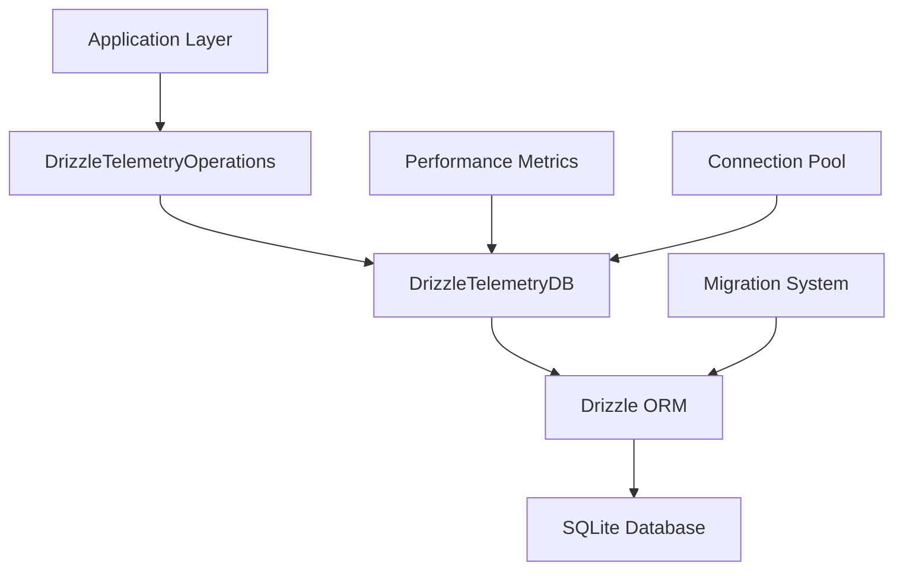

# @vibe-kit/db

Enterprise-grade database layer for VibeKit telemetry system using Drizzle ORM and SQLite.

## Table of Contents

- [Overview](#overview)
- [Features](#features)
- [Installation](#installation)
- [Quick Start](#quick-start)
- [API Reference](#api-reference)
- [Configuration](#configuration)
- [Schema](#schema)
- [Migrations](#migrations)
- [Performance](#performance)
- [Development](#development)
- [Troubleshooting](#troubleshooting)
- [Best Practices](#best-practices)

## Overview

The `@vibe-kit/db` package provides a complete database layer for the VibeKit telemetry system. Built on Drizzle ORM with SQLite, it offers type-safe database operations, automatic migrations, performance monitoring, and enterprise-grade features like foreign key constraints and audit trails.

### Architecture



## Features

- **🚀 High Performance**: WAL mode, connection pooling, and optimized indexes
- **🔒 Data Integrity**: Foreign key constraints and transaction safety
- **📊 Comprehensive Schema**: 8+ tables for complete telemetry data management
- **🔄 Migration System**: Safe schema evolution with rollback support
- **📈 Performance Monitoring**: Query metrics and slow query tracking
- **🎯 Type Safety**: Full TypeScript support with Drizzle ORM
- **🧹 Auto-Maintenance**: Automatic data pruning and optimization
- **🔍 Advanced Querying**: Complex filters, aggregations, and statistics

## Installation

```bash
npm install @vibe-kit/db

# Required peer dependencies
npm install drizzle-orm better-sqlite3
```

## Quick Start

### Basic Setup

```typescript
import { DrizzleTelemetryDB, DrizzleTelemetryOperations } from '@vibe-kit/db';

// Initialize database
const db = new DrizzleTelemetryDB({
  dbPath: '.vibekit/telemetry.db',
  enableWAL: true,
  enableForeignKeys: true,
  pruneDays: 30
});

await db.initialize();

// Create operations instance
const operations = new DrizzleTelemetryOperations(db);
```

### Working with Sessions

```typescript
// Create a new session
await operations.createSession({
  id: 'session-123',
  agentType: 'claude',
  mode: 'code',
  status: 'active',
  startTime: Date.now(),
  sandboxId: 'sandbox-456',
  repoUrl: 'https://github.com/user/repo',
  metadata: {
    userId: 'user-789',
    environment: 'production'
  }
});

// Query sessions
const sessions = await operations.querySessions({
  agentType: 'claude',
  status: 'active',
  fromTime: Date.now() - 86400000, // Last 24 hours
  limit: 10
});

// Update session
await operations.updateSession('session-123', {
  status: 'completed',
  endTime: Date.now(),
  duration: 45000
});

// Get session with events
const sessionDetails = await operations.getSessionWithEvents('session-123');
```

### Working with Events

```typescript
// Insert single event
await operations.insertEvent({
  sessionId: 'session-123',
  eventType: 'stream',
  agentType: 'claude',
  mode: 'code',
  prompt: 'Write a React component',
  streamData: 'Here\'s a React component...',
  timestamp: Date.now(),
  metadata: {
    model: 'claude-3-sonnet',
    temperature: 0.7
  }
});

// Batch insert for performance
await operations.insertEventBatch([
  { sessionId: 's1', eventType: 'start', ... },
  { sessionId: 's1', eventType: 'stream', ... },
  { sessionId: 's1', eventType: 'end', ... }
]);

// Query events with filters
const events = await operations.queryEvents({
  sessionId: 'session-123',
  eventType: 'stream',
  category: 'claude',
  from: Date.now() - 3600000, // Last hour
  to: Date.now(),
  limit: 100,
  offset: 0
});

// Delete old events
const deleted = await operations.deleteEventsBefore(
  Date.now() - 30 * 24 * 60 * 60 * 1000 // 30 days ago
);
```

### Statistics and Analytics

```typescript
// Get comprehensive statistics
const stats = await operations.getStatistics();
console.log('Total events:', stats.totalEvents);
console.log('Total sessions:', stats.totalSessions);
console.log('Event breakdown:', stats.eventBreakdown);
console.log('Agent breakdown:', stats.agentBreakdown);
console.log('Average session duration:', stats.avgSessionDuration);

// Performance metrics
const metrics = db.getMetrics();
console.log('Total queries:', metrics.totalQueries);
console.log('Average query time:', metrics.avgQueryTime + 'ms');
console.log('Slow queries:', metrics.slowQueries);
```

## API Reference

### DrizzleTelemetryDB

The main database connection class.

```typescript
class DrizzleTelemetryDB {
  constructor(config?: DrizzleTelemetryConfig)
  
  // Lifecycle
  async initialize(): Promise<void>
  async close(): Promise<void>
  
  // Database operations
  async getDatabase(): Promise<BetterSQLite3Database>
  async healthCheck(): Promise<boolean>
  async pruneOldData(): Promise<number>
  
  // Metrics
  getMetrics(): DatabaseMetrics
  getQueryHistory(): QueryMetrics[]
  resetMetrics(): void
  
  // Configuration
  getConfig(): DrizzleTelemetryConfig
}
```

### DrizzleTelemetryOperations

High-level operations for telemetry data.

```typescript
class DrizzleTelemetryOperations {
  constructor(configOrDb?: DrizzleTelemetryConfig | DrizzleTelemetryDB)
  
  // Session operations
  async createSession(session: NewTelemetrySession): Promise<void>
  async updateSession(id: string, updates: Partial<TelemetrySession>): Promise<void>
  async querySessions(filter?: SessionQueryFilter): Promise<TelemetrySession[]>
  async getSessionWithEvents(id: string): Promise<SessionWithEvents | null>
  
  // Event operations
  async insertEvent(event: NewTelemetryEvent): Promise<void>
  async insertEventBatch(events: NewTelemetryEvent[]): Promise<BatchInsertResult>
  async queryEvents(filter?: TelemetryQueryFilter): Promise<TelemetryEvent[]>
  async deleteEvents(filter?: Partial<TelemetryQueryFilter>): Promise<number>
  async deleteEventsBefore(timestamp: number): Promise<number>
  
  // Statistics
  async getStatistics(): Promise<TelemetryStatsSummary>
  async getPerformanceMetrics(): Promise<DatabaseMetrics>
  
  // Database maintenance
  async vacuum(): Promise<void>
  async analyze(): Promise<void>
  async optimize(): Promise<void>
  async reindex(): Promise<void>
  async clearAllData(): Promise<void>
  
  // Buffer operations
  async insertEventBuffer(events: NewTelemetryEvent[]): Promise<void>
  async flushEventBuffers(): Promise<void>
  async cleanupOldBuffers(maxAgeMs: number): Promise<number>
  
  // Error tracking
  async logError(error: NewTelemetryError): Promise<void>
  async getRecentErrors(limit?: number): Promise<TelemetryError[]>
  
  // Health and status
  async getHealthStatus(): Promise<boolean>
  async close(): Promise<void>
}
```

## Configuration

### DrizzleTelemetryConfig

```typescript
interface DrizzleTelemetryConfig {
  /** Database file path (default: .vibekit/telemetry.db) */
  dbPath?: string;
  
  /** Data retention in days (default: 30) */
  pruneDays?: number;
  
  /** Stream events buffer size (default: 50) */
  streamBatchSize?: number;
  
  /** Buffer flush interval in ms (default: 1000) */
  streamFlushIntervalMs?: number;
  
  /** Maximum database size in MB (default: 100) */
  maxSizeMB?: number;
  
  /** Enable WAL mode for better concurrency (default: true) */
  enableWAL?: boolean;
  
  /** Enable foreign key constraints (default: true) */
  enableForeignKeys?: boolean;
  
  /** Connection pool size (default: 5) */
  poolSize?: number;
  
  /** Query timeout in milliseconds (default: 30000) */
  queryTimeoutMs?: number;
  
  /** Enable query performance logging (default: false) */
  enableQueryLogging?: boolean;
  
  /** Enable performance metrics collection (default: true) */
  enableMetrics?: boolean;
}
```

### Environment-Specific Configurations

```typescript
// Development
const devConfig: DrizzleTelemetryConfig = {
  dbPath: './dev-telemetry.db',
  enableQueryLogging: true,
  streamBatchSize: 25,
  pruneDays: 7
};

// Production
const prodConfig: DrizzleTelemetryConfig = {
  dbPath: '/var/lib/vibekit/telemetry.db',
  enableQueryLogging: false,
  streamBatchSize: 200,
  pruneDays: 90,
  maxSizeMB: 1000
};

// Testing
const testConfig: DrizzleTelemetryConfig = {
  dbPath: ':memory:', // In-memory database
  enableForeignKeys: false, // Faster tests
  streamBatchSize: 10
};
```

## Schema

The database uses a comprehensive schema with 8 main tables:

### Core Tables

#### telemetry_sessions
```sql
CREATE TABLE telemetry_sessions (
  id TEXT PRIMARY KEY,
  agent_type TEXT NOT NULL,
  mode TEXT NOT NULL,
  status TEXT DEFAULT 'active',
  start_time REAL NOT NULL,
  end_time REAL,
  duration REAL,
  sandbox_id TEXT,
  repo_url TEXT,
  event_count INTEGER DEFAULT 0,
  stream_event_count INTEGER DEFAULT 0,
  error_count INTEGER DEFAULT 0,
  metadata TEXT, -- JSON
  version INTEGER DEFAULT 1,
  schema_version TEXT DEFAULT '1.0.0',
  created_at REAL DEFAULT (unixepoch() * 1000),
  updated_at REAL DEFAULT (unixepoch() * 1000)
);
```

#### telemetry_events
```sql
CREATE TABLE telemetry_events (
  id INTEGER PRIMARY KEY AUTOINCREMENT,
  session_id TEXT NOT NULL REFERENCES telemetry_sessions(id),
  event_type TEXT NOT NULL,
  agent_type TEXT NOT NULL,
  mode TEXT NOT NULL,
  prompt TEXT,
  stream_data TEXT,
  sandbox_id TEXT,
  repo_url TEXT,
  metadata TEXT, -- JSON
  timestamp REAL NOT NULL,
  version INTEGER DEFAULT 1,
  schema_version TEXT DEFAULT '1.0.0',
  created_at REAL DEFAULT (unixepoch() * 1000)
);
```

### Supporting Tables

- **telemetry_buffers**: Stream event buffering for batch processing
- **telemetry_stats**: Pre-computed statistics and aggregations
- **telemetry_errors**: Error tracking with stack traces
- **telemetry_audit_log**: Complete audit trail for data changes
- **telemetry_validation_rules**: Configurable data validation
- **telemetry_schema_versions**: Schema migration tracking

### Indexes

Optimized indexes for common query patterns:

```sql
-- Session indexes
CREATE INDEX idx_sessions_agent_type ON telemetry_sessions(agent_type);
CREATE INDEX idx_sessions_status ON telemetry_sessions(status);
CREATE INDEX idx_sessions_start_time ON telemetry_sessions(start_time);

-- Event indexes
CREATE INDEX idx_events_session_id ON telemetry_events(session_id);
CREATE INDEX idx_events_timestamp ON telemetry_events(timestamp);
CREATE INDEX idx_events_event_type ON telemetry_events(event_type);
```

## Migrations

### Running Migrations

```bash
# Apply pending migrations
npm run db:migrate

# Generate new migration
npm run db:generate -- "add_user_preferences"

# Push schema changes (development only)
npm run db:push

# View database with Drizzle Studio
npm run db:studio
```

### Migration Strategy

1. **Schema-First**: Define changes in `src/schema.ts`
2. **Generate**: Create SQL migrations with `db:generate`
3. **Review**: Check generated SQL in `migrations/`
4. **Test**: Apply in development environment
5. **Deploy**: Run migrations in production

### Best Practices

- Always backup before major migrations
- Test migrations in staging environment
- Use transactions (enabled by default)
- Document breaking changes
- Version control migration files

## Performance

### Optimization Features

- **WAL Mode**: Better concurrency for read/write operations
- **Connection Pooling**: Reuse connections for efficiency
- **Batch Operations**: Bulk inserts with transactions
- **Smart Indexing**: Indexes on frequently queried columns
- **Query Caching**: In-memory cache for repeated queries
- **Automatic Vacuuming**: Periodic database optimization

### Performance Benchmarks

| Operation | Performance | Notes |
|-----------|-------------|-------|
| Single Insert | <1ms | With prepared statements |
| Batch Insert (1000) | <50ms | Using transactions |
| Simple Query | <1ms | With indexes |
| Complex Aggregation | <10ms | With proper indexes |
| Full Table Scan | <100ms | For 1M records |

### Monitoring

```typescript
// Enable query logging
const db = new DrizzleTelemetryDB({
  enableQueryLogging: true,
  enableMetrics: true
});

// Get performance metrics
const metrics = db.getMetrics();
console.log('Slow queries:', metrics.slowQueries);
console.log('Average query time:', metrics.avgQueryTime);

// Get query history
const history = db.getQueryHistory();
history.forEach(query => {
  console.log(`${query.queryType}: ${query.duration}ms`);
});
```

## Development

### Building

```bash
# Build the package
npm run build

# Type checking
npm run type-check

# Watch mode for development
npm run dev
```

### Testing

```bash
# Run tests
npm test

# Run tests with coverage
npm run test:coverage
```

### Project Structure

```
packages/db/
├── src/
│   ├── connection.ts      # Database connection management
│   ├── operations.ts      # High-level operations
│   ├── schema.ts         # Drizzle schema definitions
│   ├── types.ts          # TypeScript types
│   ├── validation.ts     # Input validation
│   └── errors.ts         # Error handling
├── migrations/           # SQL migration files
├── scripts/             # Database scripts
└── tests/              # Test files
```

## Troubleshooting

### Common Issues

#### Database Locked Error
```bash
# Solution: Close all connections
killall node
rm .vibekit/telemetry.db-wal
rm .vibekit/telemetry.db-shm
```

#### Migration Failed
```typescript
// Check for constraint violations
const db = new DrizzleTelemetryDB({
  enableForeignKeys: false // Temporarily disable
});

// Fix data issues, then re-enable
```

#### Performance Issues
```typescript
// Run optimization
await operations.optimize(); // VACUUM + ANALYZE
await operations.reindex();  // Rebuild indexes

// Check slow queries
const metrics = db.getMetrics();
console.log('Slow queries:', metrics.slowQueries);
```

### Debug Mode

```typescript
// Enable verbose logging
const db = new DrizzleTelemetryDB({
  enableQueryLogging: true,
  debug: true
});

// Set environment variable
process.env.DEBUG = 'drizzle:*';
```

## Best Practices

### 1. Connection Management
```typescript
// Use singleton pattern
let dbInstance: DrizzleTelemetryDB;

export function getDB() {
  if (!dbInstance) {
    dbInstance = new DrizzleTelemetryDB();
  }
  return dbInstance;
}

// Always close connections
process.on('SIGTERM', async () => {
  await dbInstance?.close();
});
```

### 2. Batch Operations
```typescript
// Good: Batch insert
await operations.insertEventBatch(events);

// Bad: Individual inserts in loop
for (const event of events) {
  await operations.insertEvent(event); // Slow!
}
```

### 3. Query Optimization
```typescript
// Use specific filters
const events = await operations.queryEvents({
  sessionId: 'specific-id',
  eventType: 'stream',
  limit: 100
});

// Avoid unbounded queries
// Bad: await operations.queryEvents(); // Returns all!
```

### 4. Data Retention
```typescript
// Set up automatic pruning
const db = new DrizzleTelemetryDB({
  pruneDays: 30 // Auto-delete old data
});

// Manual cleanup
await operations.deleteEventsBefore(
  Date.now() - 30 * 24 * 60 * 60 * 1000
);
```

### 5. Error Handling
```typescript
try {
  await operations.insertEvent(event);
} catch (error) {
  if (error.code === 'SQLITE_CONSTRAINT') {
    // Handle constraint violation
  } else if (error.code === 'SQLITE_BUSY') {
    // Retry with backoff
  } else {
    // Log and handle gracefully
    await operations.logError({
      sessionId: event.sessionId,
      errorType: 'insert_failed',
      errorMessage: error.message,
      stackTrace: error.stack
    });
  }
}
```

## License

MIT © Superagent

---

For more information, visit the [VibeKit documentation](https://docs.vibekit.sh/).