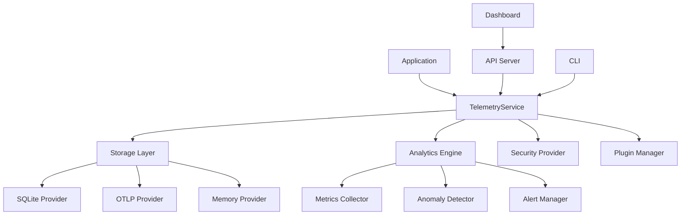

# @vibe-kit/telemetry

Enterprise-grade telemetry system for AI-powered applications with real-time analytics, security features, and extensible architecture.

## Table of Contents

- [Overview](#overview)
- [Features](#features)
- [Installation](#installation)
- [Quick Start](#quick-start)
- [Core Concepts](#core-concepts)
- [Configuration](#configuration)
- [API Reference](#api-reference)
- [CLI Usage](#cli-usage)
- [Analytics & Monitoring](#analytics--monitoring)
- [Security Features](#security-features)
- [Plugin System](#plugin-system)
- [Export & Integration](#export--integration)
- [Performance](#performance)
- [Troubleshooting](#troubleshooting)
- [Best Practices](#best-practices)

## Overview

The `@vibe-kit/telemetry` package provides a comprehensive telemetry solution for modern AI applications. It offers high-performance event tracking, real-time analytics, security features, and seamless integration with various backends including SQLite, OpenTelemetry, and custom storage providers.

### Architecture



## Features

### Core Features
- **🚀 High Performance**: Sub-millisecond event tracking with intelligent buffering
- **📊 Real-time Analytics**: Live metrics, insights, and anomaly detection
- **🔌 Extensible**: Plugin system for custom implementations
- **🔒 Secure**: Built-in PII detection, data encryption, and audit trails
- **📤 Multi-format Export**: JSON, CSV, OTLP, Parquet, and more
- **🎯 Framework Agnostic**: Works with any Node.js application
- **⚡ Streaming Support**: WebSocket, SSE, and gRPC streaming providers
- **🛠️ Enterprise CLI**: 20+ commands for management and analysis

### Advanced Features
- **🧠 AI-Powered Analytics**: Anomaly detection and predictive insights
- **🔄 Reliability Features**: Circuit breakers, retries, and backpressure
- **📈 Performance Monitoring**: Query metrics and resource tracking
- **🌐 Multi-Transport**: HTTP, WebSocket, gRPC support
- **📝 Comprehensive Audit Trail**: Track all data modifications
- **🔧 Auto-Maintenance**: Data pruning and optimization

## Installation

```bash
npm install @vibe-kit/telemetry

# Required dependencies for SQLite storage (recommended)
npm install @vibe-kit/db        # Database layer with Drizzle ORM
npm install better-sqlite3      # SQLite3 native bindings

# Optional dependencies for specific features
npm install @opentelemetry/api  # For OTLP export
npm install ws                  # For WebSocket streaming
```

### Dependencies Explained

- **@vibe-kit/db**: Provides the SQLite database layer with Drizzle ORM. **Required if you plan to use SQLite storage** (recommended for most use cases). See the [@vibe-kit/db documentation](../db/README.md) for detailed setup and migration information.
- **better-sqlite3**: Native SQLite3 bindings required by @vibe-kit/db
- **@opentelemetry/api**: Only needed if you plan to export telemetry data to OpenTelemetry collectors
- **ws**: Only needed if you plan to use WebSocket streaming features

## Quick Start

### Basic Setup

```typescript
import { TelemetryService } from '@vibe-kit/telemetry';

// Initialize telemetry
const telemetry = new TelemetryService({
  serviceName: 'my-ai-app',
  serviceVersion: '1.0.0',
  
  // Storage configuration
  storage: [{
    type: 'sqlite',
    enabled: true,
    options: {
      path: '.vibekit/telemetry.db',
      streamBatchSize: 100,
      streamFlushInterval: 1000
    }
  }],
  
  // Analytics configuration
  analytics: {
    enabled: true,
    metrics: { enabled: true },
    anomaly: { enabled: true }
  },
  
  // API server configuration
  api: {
    enabled: true,
    port: 3000
  }
});

await telemetry.initialize();
```

### Tracking Events

```typescript
// Start a session
const sessionId = await telemetry.trackStart('claude', 'code', 'Fix this bug');

// Track streaming data
await telemetry.trackStream({
  sessionId,
  eventType: 'stream',
  category: 'claude',
  action: 'code',
  streamData: 'Here\'s the fix for your bug...',
  metadata: {
    model: 'claude-3-sonnet',
    temperature: 0.7
  }
});

// Track completion
await telemetry.trackEnd(sessionId, 'completed');

// Track custom events
await telemetry.track({
  eventType: 'custom',
  category: 'user-action',
  action: 'button-click',
  label: 'submit-form',
  value: 1,
  metadata: {
    formId: 'user-preferences',
    duration: 1500
  }
});
```

### Querying Data

```typescript
// Query events
const events = await telemetry.query({
  category: 'claude',
  eventType: 'stream',
  timeRange: {
    start: Date.now() - 3600000, // Last hour
    end: Date.now()
  },
  limit: 100
});

// Get session details
const session = await telemetry.getSession(sessionId);

// Get analytics
const analytics = await telemetry.getInsights({
  timeRange: { start: Date.now() - 86400000 }, // Last 24 hours
  categories: ['claude', 'gpt-4']
});
```

## Core Concepts

### Events

Events are the fundamental unit of telemetry data:

```typescript
interface TelemetryEvent {
  sessionId?: string;
  eventType: 'start' | 'stream' | 'end' | 'error' | 'custom';
  category: string;
  action?: string;
  label?: string;
  value?: number;
  timestamp?: number;
  metadata?: Record<string, any>;
}
```

### Sessions

Sessions group related events together:

```typescript
// Session lifecycle
const sessionId = await telemetry.trackStart('agent', 'mode', 'prompt');
// ... track events ...
await telemetry.trackEnd(sessionId, 'completed');
```

### Storage Providers

Multiple storage backends are supported:

```typescript
// SQLite (recommended for local development)
// Requires @vibe-kit/db package
storage: [{
  type: 'sqlite',
  enabled: true,
  options: { path: '.vibekit/telemetry.db' }
}]

// OpenTelemetry
storage: [{
  type: 'otlp',
  enabled: true,
  options: { 
    endpoint: 'http://localhost:4318',
    headers: { 'api-key': 'your-key' }
  }
}]

// In-memory (for testing)
storage: [{
  type: 'memory',
  enabled: true
}]
```

## Configuration

### Complete Configuration Options

```typescript
interface TelemetryConfig {
  // Service identification
  serviceName: string;
  serviceVersion: string;
  environment?: string;
  
  // Storage providers (multiple supported)
  storage?: StorageConfig[];
  
  // Streaming configuration
  streaming?: {
    enabled?: boolean;
    provider?: 'websocket' | 'sse' | 'grpc';
    options?: StreamingOptions;
  };
  
  // Security settings
  security?: {
    encryption?: {
      enabled?: boolean;
      algorithm?: string;
      keyDerivation?: string;
    };
    pii?: {
      enabled?: boolean;
      patterns?: string[];
      customDetectors?: PIIDetector[];
    };
    redaction?: {
      enabled?: boolean;
      fields?: string[];
    };
  };
  
  // Reliability features
  reliability?: {
    circuitBreaker?: {
      enabled?: boolean;
      threshold?: number;
      timeout?: number;
    };
    retry?: {
      enabled?: boolean;
      maxAttempts?: number;
      backoff?: 'linear' | 'exponential';
    };
    rateLimit?: {
      enabled?: boolean;
      maxRequests?: number;
      windowMs?: number;
    };
  };
  
  // Analytics configuration
  analytics?: {
    enabled?: boolean;
    metrics?: {
      enabled?: boolean;
      interval?: number;
      persistence?: boolean;
    };
    anomaly?: {
      enabled?: boolean;
      sensitivity?: 'low' | 'medium' | 'high';
      metrics?: string[];
    };
    alerts?: {
      enabled?: boolean;
      channels?: AlertChannel[];
    };
  };
  
  // API server configuration
  api?: {
    enabled?: boolean;
    port?: number;
    host?: string;
    cors?: CorsOptions;
    auth?: AuthConfig;
    dashboard?: boolean;
  };
  
  // Plugin configuration
  plugins?: TelemetryPlugin[];
}
```

### Environment-Specific Configurations

```typescript
// Development
const devConfig: Partial<TelemetryConfig> = {
  environment: 'development',
  storage: [{
    type: 'sqlite',
    enabled: true,
    options: {
      path: './dev-telemetry.db',
      streamBatchSize: 25
    }
  }],
  analytics: {
    enabled: true,
    metrics: { enabled: true, interval: 5000 }
  }
};

// Production
const prodConfig: Partial<TelemetryConfig> = {
  environment: 'production',
  storage: [
    {
      type: 'sqlite',
      enabled: true,
      options: {
        path: '/var/lib/vibekit/telemetry.db',
        streamBatchSize: 200
      }
    },
    {
      type: 'otlp',
      enabled: true,
      options: {
        endpoint: process.env.OTLP_ENDPOINT,
        headers: { 'api-key': process.env.OTLP_API_KEY }
      }
    }
  ],
  security: {
    encryption: { enabled: true },
    pii: { enabled: true }
  },
  reliability: {
    circuitBreaker: { enabled: true },
    retry: { enabled: true }
  }
};
```

## API Reference

### TelemetryService

The main service class:

```typescript
class TelemetryService {
  // Lifecycle
  async initialize(): Promise<void>
  async shutdown(): Promise<void>
  
  // Session tracking
  async trackStart(agent: string, mode: string, prompt: string): Promise<string>
  async trackStream(params: StreamParams): Promise<void>
  async trackEnd(sessionId: string, status: string): Promise<void>
  async trackError(params: ErrorParams): Promise<void>
  
  // Event tracking
  async track(event: TelemetryEvent): Promise<void>
  async trackBatch(events: TelemetryEvent[]): Promise<void>
  
  // Querying
  async query(filter?: QueryFilter): Promise<TelemetryEvent[]>
  async getSession(sessionId: string): Promise<Session | null>
  async getSessions(filter?: SessionFilter): Promise<Session[]>
  
  // Analytics
  async getMetrics(timeRange?: TimeRange): Promise<Metrics>
  async getInsights(options?: InsightOptions): Promise<Insights>
  async getHealthStatus(): Promise<HealthStatus>
  
  // Export
  async export(format: string, filter?: QueryFilter): Promise<string>
  
  // API server
  async startAPIServer(options?: APIServerOptions): Promise<TelemetryAPIServer>
  
  // Utilities
  async clean(retentionDays: number): Promise<number>
  on(event: string, handler: Function): void
}
```

### Event Builder

Fluent API for building events:

```typescript
const event = new EventBuilder()
  .withSessionId('session-123')
  .withCategory('claude')
  .withAction('code-generation')
  .withLabel('react-component')
  .withValue(150)
  .withMetadata({
    language: 'typescript',
    framework: 'react',
    complexity: 'medium'
  })
  .build();

await telemetry.track(event);
```

## CLI Usage

The telemetry package includes a comprehensive CLI:

### Installation

```bash
# Global installation
npm install -g @vibe-kit/telemetry

# Or use npx
npx @vibe-kit/telemetry <command>
```

### Commands

#### API Server
```bash
# Start API server
telemetry api --port 3000

# With authentication
telemetry api --port 3000 --auth --api-key your-secret-key

# With dashboard
telemetry api --port 3000 --dashboard
```

#### Querying
```bash
# Query events
telemetry query --category claude --limit 100 --format table

# Query with time range
telemetry query --since 1h --until now --format json

# Query sessions
telemetry sessions --status active --agent claude

# Get specific session
telemetry session <session-id> --with-events
```

#### Analytics
```bash
# Get metrics
telemetry metrics --format json

# Real-time dashboard
telemetry analytics dashboard

# Performance report
telemetry analytics performance --since 24h

# Anomaly detection
telemetry analytics anomalies --sensitivity high
```

#### Export
```bash
# Export to JSON
telemetry export --format json --output events.json

# Export to CSV
telemetry export --format csv --output events.csv --delimiter ","

# Export to OTLP
telemetry export --format otlp --sessions session-1,session-2

# Export with compression
telemetry export --format json --compress gzip --output events.json.gz
```

#### Maintenance
```bash
# Clean old data
telemetry clean --days 30

# Optimize database
telemetry optimize

# Check health
telemetry health --detailed
```

## Analytics & Monitoring

### Real-time Analytics

```typescript
// Get real-time metrics
const metrics = await telemetry.getMetrics();
console.log(`
Events per minute: ${metrics.events.perMinute}
Active sessions: ${metrics.sessions.active}
Error rate: ${metrics.errors.rate}%
Average response time: ${metrics.performance.avgLatency}ms
`);
```

### Anomaly Detection

```typescript
// Configure anomaly detection
telemetry.on('anomaly', (anomaly) => {
  console.log(`Anomaly detected: ${anomaly.metric}`);
  console.log(`Severity: ${anomaly.severity}`);
  console.log(`Details: ${anomaly.description}`);
});

// Manual anomaly check
const anomalies = await telemetry.detectAnomalies([
  'response_time',
  'error_rate',
  'throughput'
]);
```

### Custom Metrics

```typescript
// Define custom metrics
telemetry.defineMetric({
  name: 'token_usage',
  type: 'counter',
  unit: 'tokens',
  description: 'Total tokens consumed'
});

// Track custom metric
await telemetry.track({
  eventType: 'custom',
  category: 'metrics',
  action: 'token_usage',
  value: 1500
});
```

## Security Features

The telemetry service includes multiple security layers to protect your data and infrastructure:

### Overview

- **CORS Protection**: Control which domains can access your telemetry API
- **API Authentication**: Secure endpoints with API keys and bearer tokens
- **Rate Limiting**: Built-in protection against abuse (100 req/15 min per IP)
- **Input Validation**: Comprehensive validation using Zod schemas
- **Data Encryption**: AES-256 encryption for sensitive data at rest
- **Path Traversal Protection**: Prevent directory traversal attacks
- **PII Detection & Redaction**: Automatic detection and redaction of sensitive data
- **Security Headers**: Helmet.js integration for secure HTTP headers

### Quick Security Setup

1. **Generate secure keys**:
```bash
# Generate encryption key (32 bytes)
openssl rand -hex 32

# Generate API keys
openssl rand -hex 32
openssl rand -hex 32
```

2. **Configure environment variables**:
```env
# CORS Protection
TELEMETRY_ALLOWED_ORIGINS=https://app.example.com,https://dashboard.example.com

# API Authentication
TELEMETRY_AUTH_ENABLED=true
TELEMETRY_API_KEYS=abc123...,def456...
TELEMETRY_BEARER_TOKENS=token1...,token2...

# Data Encryption
TELEMETRY_ENCRYPTION_ENABLED=true
TELEMETRY_ENCRYPTION_KEY=0123456789abcdef... # 64 hex chars
```

### CORS Protection

Control which domains can access your telemetry API:

```typescript
// Configure CORS
const telemetry = new TelemetryService({
  api: {
    cors: {
      origins: ['https://app.example.com', 'https://dashboard.example.com'],
      credentials: true
    }
  }
});

// Or via environment variable
// TELEMETRY_ALLOWED_ORIGINS=https://app.example.com,https://dashboard.example.com
```

### API Authentication

Protect your API endpoints with multiple authentication methods:

```typescript
// Configure authentication
const telemetry = new TelemetryService({
  api: {
    auth: {
      enabled: true,
      apiKeys: ['your-api-key-1', 'your-api-key-2'],
      bearerTokens: ['bearer-token-1', 'bearer-token-2']
    }
  }
});

// Use in requests
// API Key: curl -H "X-API-Key: your-api-key-1" https://api.example.com/api/events
// Bearer: curl -H "Authorization: Bearer bearer-token-1" https://api.example.com/api/events
```

### PII Detection & Redaction

Automatically detect and redact personally identifiable information:

```typescript
// Configure PII detection
const telemetry = new TelemetryService({
  security: {
    pii: {
      enabled: true,
      patterns: [
        'email',
        'phone',
        'ssn',
        'credit_card'
      ],
      customDetectors: [{
        name: 'api_key',
        pattern: /sk-[a-zA-Z0-9]{48}/g,
        replacement: '[REDACTED_API_KEY]'
      }]
    }
  }
});

// Events are automatically scanned and redacted
await telemetry.track({
  category: 'user',
  action: 'update',
  metadata: {
    email: 'user@example.com', // Automatically redacted to '[REDACTED_EMAIL]'
    apiKey: 'sk-abc123...'      // Custom redaction to '[REDACTED_API_KEY]'
  }
});
```

### Data Encryption

Encrypt sensitive telemetry data at rest:

```typescript
// Enable encryption at rest
const telemetry = new TelemetryService({
  security: {
    encryption: {
      enabled: true,
      algorithm: 'aes-256-ctr',
      keyDerivation: 'pbkdf2'
    }
  }
});

// All sensitive data is encrypted before storage
// Encryption key from TELEMETRY_ENCRYPTION_KEY env var
```

⚠️ **Important**: Store your encryption key securely. Lost keys mean unrecoverable data!

### Rate Limiting

Built-in rate limiting protects against abuse:

```typescript
// Default: 100 requests per 15 minutes per IP
// Applied to all /api/ endpoints
// Returns 429 Too Many Requests when exceeded

// Custom rate limiting
const telemetry = new TelemetryService({
  api: {
    rateLimit: {
      windowMs: 15 * 60 * 1000, // 15 minutes
      max: 100 // limit each IP to 100 requests per windowMs
    }
  }
});
```

### Input Validation

All API inputs are validated using Zod schemas:

```typescript
// Invalid inputs return detailed error messages:
// {
//   "error": "Validation Error",
//   "message": "Invalid query parameters",
//   "details": [
//     {
//       "field": "limit",
//       "message": "Number must be between 1 and 1000"
//     }
//   ]
// }
```

### Audit Trail

Enable comprehensive audit logging for compliance:

```typescript
// Enable audit logging
const telemetry = new TelemetryService({
  security: {
    audit: {
      enabled: true,
      events: ['create', 'update', 'delete', 'export']
    }
  }
});

// Query audit logs
const auditLogs = await telemetry.getAuditLogs({
  action: 'export',
  since: Date.now() - 86400000
});
```

### Security Best Practices

1. **Use HTTPS**: Always deploy with TLS/SSL in production
2. **Rotate Keys**: Regularly rotate API keys and tokens
3. **Monitor Access**: Review logs for suspicious activity
4. **Limit Origins**: Only allow necessary domains in CORS
5. **Secure Storage**: Use environment variables or secret management systems
6. **Regular Updates**: Keep dependencies up to date
7. **Least Privilege**: Grant minimal required permissions

### Threat Model

The telemetry service protects against:

- **Cross-Site Scripting (XSS)**: CSP headers, input sanitization
- **SQL Injection**: Parameterized queries, input validation
- **Directory Traversal**: Path validation and normalization
- **DoS Attacks**: Rate limiting, resource limits
- **Data Exposure**: Encryption, authentication, PII detection

### Security Checklist

Before deploying to production:

- [ ] Generated strong encryption key (32 bytes)
- [ ] Generated unique API keys
- [ ] Configured CORS origins appropriately
- [ ] Enabled authentication for API endpoints
- [ ] Set up HTTPS/TLS certificates
- [ ] Reviewed and adjusted rate limits
- [ ] Tested with security scanner
- [ ] Configured monitoring/alerting
- [ ] Documented key storage process
- [ ] Set up key rotation schedule
- [ ] Enabled PII detection if handling user data
- [ ] Configured audit logging for compliance

### Reporting Security Issues

Found a security vulnerability? Please report it responsibly:
- Email: security@vibekit.io
- Do NOT open public issues for security vulnerabilities
- We aim to respond within 48 hours

## Plugin System

### Creating Plugins

```typescript
import { TelemetryPlugin, PluginContext } from '@vibe-kit/telemetry';

class CustomStoragePlugin implements TelemetryPlugin {
  name = 'custom-storage';
  version = '1.0.0';
  
  async initialize(context: PluginContext): Promise<void> {
    // Plugin initialization
  }
  
  async beforeTrack(event: TelemetryEvent): Promise<TelemetryEvent> {
    // Modify event before tracking
    return event;
  }
  
  async afterTrack(event: TelemetryEvent): Promise<void> {
    // Post-processing after tracking
  }
  
  async shutdown(): Promise<void> {
    // Cleanup
  }
}

// Register plugin
const telemetry = new TelemetryService({
  plugins: [new CustomStoragePlugin()]
});
```

### Built-in Plugins

```typescript
import {
  CachePlugin,
  S3ExportPlugin,
  CompliancePlugin,
  EncryptionPlugin
} from '@vibe-kit/telemetry/plugins';

const telemetry = new TelemetryService({
  plugins: [
    // Cache frequently accessed data
    new CachePlugin({
      ttl: 300000, // 5 minutes
      maxSize: 1000
    }),
    
    // Export to S3
    new S3ExportPlugin({
      bucket: 'telemetry-exports',
      region: 'us-east-1'
    }),
    
    // GDPR compliance
    new CompliancePlugin({
      regulations: ['gdpr', 'ccpa'],
      retentionDays: 90
    })
  ]
});
```

## Export & Integration

### Export Formats

```typescript
// JSON export
const jsonData = await telemetry.export('json', {
  sessionId: 'session-123',
  compress: true
});

// CSV export
const csvData = await telemetry.export('csv', {
  category: 'claude',
  delimiter: ',',
  headers: true
});

// OpenTelemetry format
const otlpData = await telemetry.export('otlp', {
  sessions: ['session-1', 'session-2']
});

// Parquet format (requires optional dependency)
const parquetData = await telemetry.export('parquet', {
  schema: 'events',
  compression: 'snappy'
});
```

### Integration Examples

#### OpenTelemetry Collector
```typescript
const telemetry = new TelemetryService({
  storage: [{
    type: 'otlp',
    enabled: true,
    options: {
      endpoint: 'http://otel-collector:4318',
      headers: {
        'api-key': process.env.OTLP_API_KEY
      },
      resourceAttributes: {
        'service.name': 'my-app',
        'service.version': '1.0.0'
      }
    }
  }]
});
```

#### Prometheus Metrics
```typescript
// Expose Prometheus metrics endpoint
const apiServer = await telemetry.startAPIServer({
  port: 3000,
  metrics: {
    prometheus: true,
    endpoint: '/metrics'
  }
});
```

#### Grafana Dashboard
```yaml
# docker-compose.yml
services:
  telemetry:
    image: vibekit/telemetry
    ports:
      - "3000:3000"
  
  prometheus:
    image: prom/prometheus
    volumes:
      - ./prometheus.yml:/etc/prometheus/prometheus.yml
  
  grafana:
    image: grafana/grafana
    ports:
      - "3001:3000"
```

## Performance

### Optimization Strategies

```typescript
// Batch processing
const batcher = telemetry.createBatcher({
  batchSize: 100,
  flushInterval: 1000,
  maxRetries: 3
});

// Use batcher for high-volume events
await batcher.add(event);

// Stream processing
const stream = telemetry.createEventStream();
stream.pipe(transformStream).pipe(destinationStream);

// Connection pooling
const telemetry = new TelemetryService({
  storage: [{
    type: 'sqlite',
    options: {
      poolSize: 10,
      idleTimeout: 30000
    }
  }]
});
```

### Performance Benchmarks

| Operation | Throughput | Latency | Notes |
|-----------|------------|---------|-------|
| Event tracking | 10,000/sec | <1ms | With batching |
| Query (indexed) | 5,000/sec | <2ms | Simple queries |
| Analytics | 100/sec | <50ms | Complex aggregations |
| Export (JSON) | 1M events/min | - | With compression |

### Resource Usage

```typescript
// Monitor resource usage
const health = await telemetry.getHealthStatus();
console.log(`
Memory: ${health.memory.used}/${health.memory.total} MB
CPU: ${health.cpu.usage}%
Storage: ${health.storage.used}/${health.storage.total} GB
Connections: ${health.connections.active}/${health.connections.max}
`);
```

## Troubleshooting

### Common Issues

#### High Memory Usage
```typescript
// Enable memory limits
const telemetry = new TelemetryService({
  reliability: {
    memoryLimit: 512 * 1024 * 1024, // 512MB
    gcInterval: 60000 // GC every minute
  }
});

// Monitor memory
telemetry.on('memory:high', (usage) => {
  console.warn(`High memory usage: ${usage.percentage}%`);
});
```

#### Connection Issues
```typescript
// Enable connection retry
const telemetry = new TelemetryService({
  reliability: {
    retry: {
      enabled: true,
      maxAttempts: 5,
      backoff: 'exponential'
    }
  }
});

// Monitor connection health
telemetry.on('connection:error', (error) => {
  console.error('Connection error:', error);
});
```

#### Data Loss Prevention
```typescript
// Enable local buffering
const telemetry = new TelemetryService({
  storage: [{
    type: 'sqlite',
    options: {
      bufferOnError: true,
      bufferSize: 10000,
      persistBuffer: true
    }
  }]
});
```

### Debug Mode

```typescript
// Enable debug logging
const telemetry = new TelemetryService({
  debug: true,
  logLevel: 'debug'
});

// Or use environment variable
process.env.DEBUG = 'vibekit:telemetry:*';
```

### Health Checks

```bash
# CLI health check
telemetry health --detailed

# API health endpoint
curl http://localhost:3000/health

# Programmatic health check
const health = await telemetry.getHealthStatus();
if (!health.healthy) {
  console.error('Unhealthy components:', health.issues);
}
```

## Best Practices

### 1. Session Management
```typescript
// Always use try-finally for session cleanup
const sessionId = await telemetry.trackStart('claude', 'chat', prompt);
try {
  // Your application logic
  await processWithAI(prompt);
} finally {
  // Ensure session is ended
  await telemetry.trackEnd(sessionId, 'completed');
}
```

### 2. Error Handling
```typescript
// Wrap telemetry calls
class TelemetryWrapper {
  async trackSafe(event: TelemetryEvent): Promise<void> {
    try {
      await this.telemetry.track(event);
    } catch (error) {
      // Log but don't throw - telemetry shouldn't break app
      console.error('Telemetry error:', error);
      // Optionally send to error tracking service
    }
  }
}
```

### 3. Batching for Performance
```typescript
// Collect events in batches
const eventBuffer: TelemetryEvent[] = [];
const BATCH_SIZE = 100;
const FLUSH_INTERVAL = 5000;

async function trackEvent(event: TelemetryEvent) {
  eventBuffer.push(event);
  
  if (eventBuffer.length >= BATCH_SIZE) {
    await flushEvents();
  }
}

async function flushEvents() {
  if (eventBuffer.length === 0) return;
  
  const events = eventBuffer.splice(0);
  await telemetry.trackBatch(events);
}

// Periodic flush
setInterval(flushEvents, FLUSH_INTERVAL);
```

### 4. Metadata Standards
```typescript
// Establish consistent metadata schema
interface StandardMetadata {
  userId?: string;
  organizationId?: string;
  environment: string;
  version: string;
  feature?: string;
  [key: string]: any;
}

// Helper function
function createEvent(
  type: string,
  action: string,
  metadata: Partial<StandardMetadata> = {}
): TelemetryEvent {
  return {
    eventType: 'custom',
    category: type,
    action,
    metadata: {
      environment: process.env.NODE_ENV,
      version: process.env.APP_VERSION,
      ...metadata
    }
  };
}
```

### 5. Privacy & Compliance
```typescript
// Implement data minimization
const telemetry = new TelemetryService({
  security: {
    pii: { enabled: true },
    dataMinimization: {
      enabled: true,
      excludeFields: ['password', 'token', 'secret'],
      includeOnly: ['necessary', 'fields']
    }
  },
  compliance: {
    gdpr: {
      enabled: true,
      anonymizeAfter: 30, // days
      deleteAfter: 90 // days
    }
  }
});
```

## Dashboard Integration

For a full-featured real-time dashboard, use with `@vibe-kit/dashboard`:

```bash
# Start telemetry API
telemetry api --port 3000

# In another terminal, start dashboard
npm install @vibe-kit/dashboard
vibekit-dashboard --api-url http://localhost:3000
```

Or use the integrated dashboard:

```bash
# Start with built-in dashboard
telemetry api --port 3000 --dashboard --dashboard-port 3001
```

## License

MIT © Superagent

---

For more information, visit the [VibeKit documentation](https://docs.vibekit.sh/).